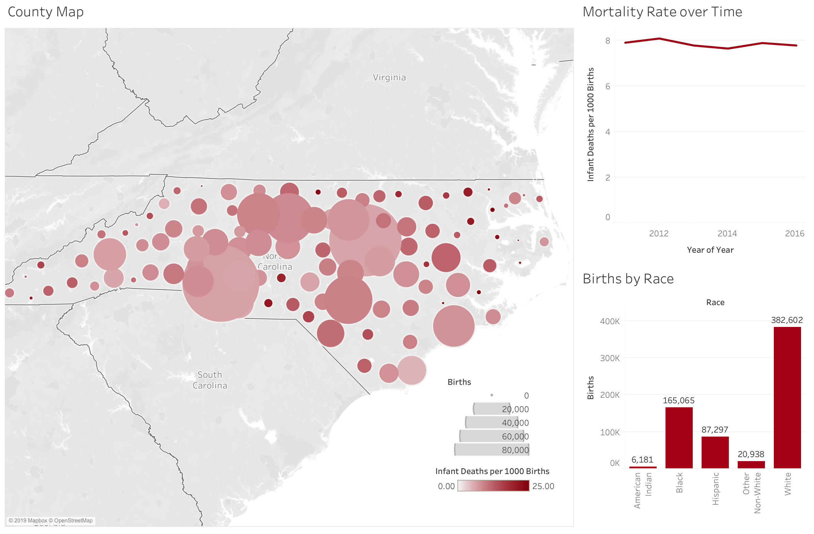
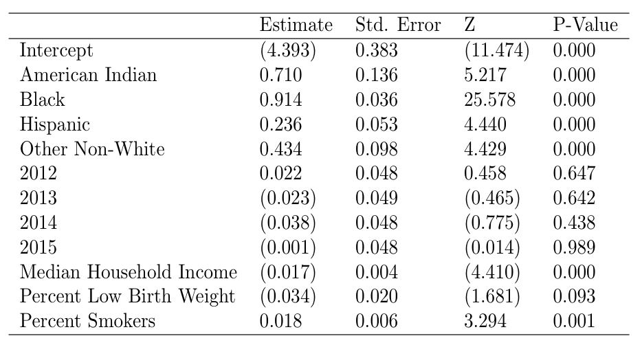
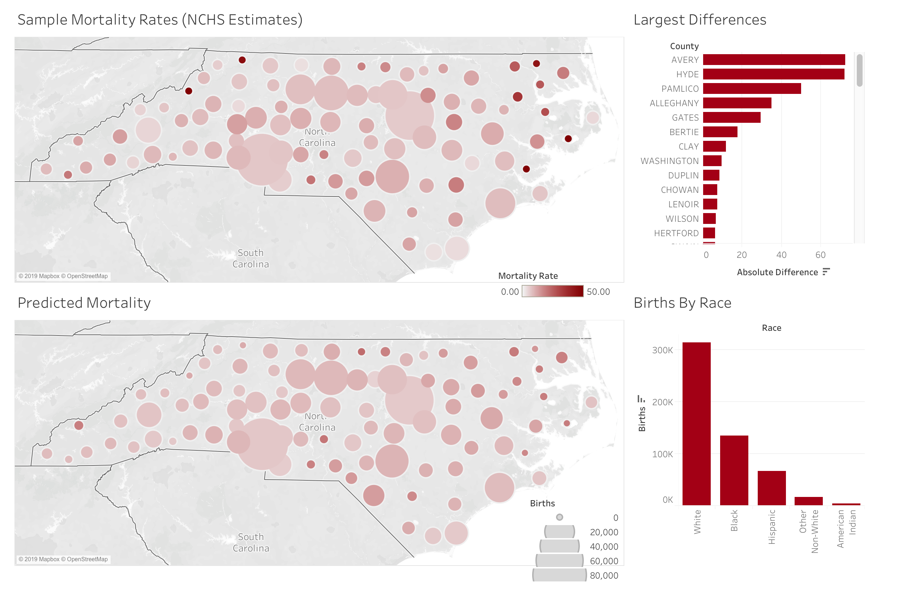
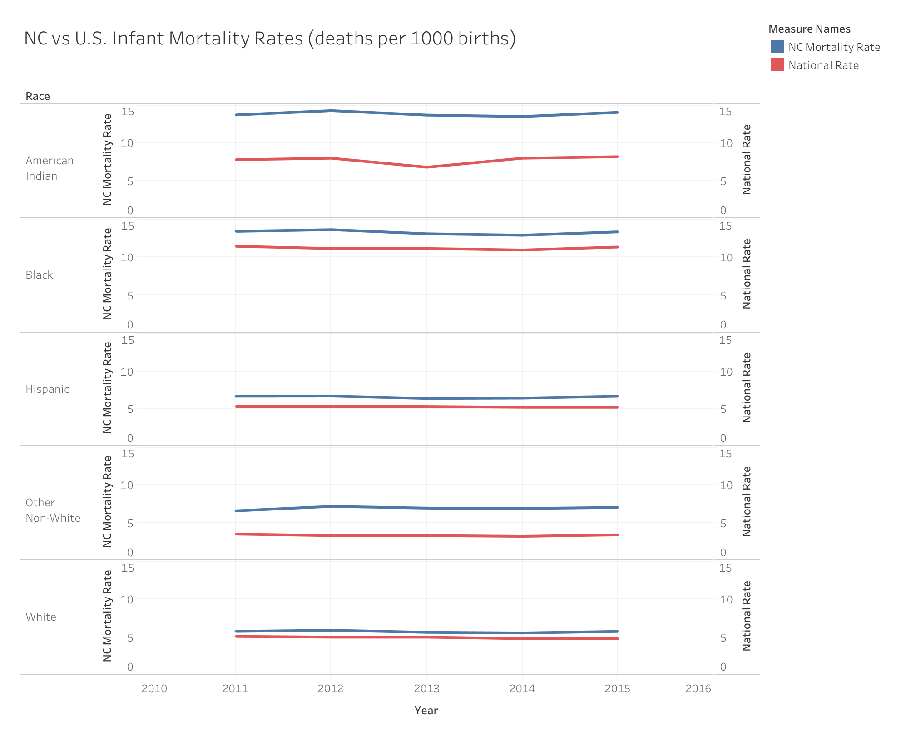

```{r, echo=FALSE, message=FALSE}
library(dplyr)
library(ggplot2)
library(stringr)
library(tidyr)
library(lme4)
library(sjPlot)
library(brms)
library(pROC)
library(gridExtra)

select = dplyr::select
```

```{r, echo=FALSE}
#read in mortality
mortality = read.csv("nc_infant_mortality.csv") %>%
  mutate(COUNTY = str_remove_all(COUNTY, " "))

 
mortality$COUNTY[which(mortality$COUNTY == "McDOWELL")] = "MCDOWELL"
mortality$COUNTY[which(mortality$COUNTY == "TYRELL")] = "TYRRELL"

demos = read.csv("Data/County_Demo_Data.csv")
demos.clean = demos %>%
  mutate(COUNTY = toupper(COUNTY) %>% str_remove_all(" ")) %>%
  mutate(pctSmokers = replace_na(pctSmokers, mean(pctSmokers, na.rm=TRUE)))

demos2016 = read.csv("Data/County_Demo_Data2016.csv")
demos2016.clean = demos %>%
  mutate(COUNTY = toupper(COUNTY) %>% str_remove_all(" ")) %>%
  mutate(pctSmokers = replace_na(pctSmokers, mean(pctSmokers, na.rm=TRUE)))
mortality2016 = mortality %>%
  filter(YOB == 2016)

mortality2016 = merge(mortality2016 , demos2016.clean, by = "COUNTY")

mortality2016 = mortality2016 %>%
  mutate(mortality_rate = mortality / 1000, race = relevel(race, "White")) %>%
  mutate(Median_Household_Income = Median_Household_Income / 1000)

mortality = merge(mortality , demos.clean, by = "COUNTY")

mortality = mortality %>%
  mutate(mortality_rate = mortality / 1000, race = relevel(race, "White")) %>%
  mutate(Median_Household_Income = Median_Household_Income / 1000) 

mortality = mortality %>%
  filter(YOB != 2016)
```

```{r, echo=FALSE}
# replicate 2015 SCHS table exactly
SCHS_Table_2015 = mortality %>%
  mutate(race = relevel(race, "White")) %>%
  filter(YOB == 2015) %>%
  select(mortality, race, COUNTY, deaths) %>%
  mutate(smallSample = deaths < 10) %>%
  select(-deaths, -smallSample) %>%
  spread(race, mortality)
```
### Introduction
This case study aims to obtain robust estimates for mortality rates by race and year across North Carolina counties based on 2011-2016 mortality data from the North Carolina Center for Health Statistics. We supplemented this data with health and demographic data from a study performed by the Robert Wood Johnson Foundation. We explored correlations between mortality rate and percent insured, median household income, percent low birth weight, percent obese, and percent smokers. Through EDA and model fitting, we narrowed these features down and created a model that predict mortality rates by race, year and county, utilizing percent low birth weight, percent smokers, and median household income. We then comment on trends by group over time and compare those trends to the national averages.


### Exploratory Data Analysis
```{r, echo=FALSE, warning=FALSE, results="hide" }
# Dropping outliers for the purpose of EDA plots.
q3 = quantile(mortality$mortality, 0.75)
q1 = quantile(mortality$mortality, 0.25)
IQR = q3-q1
m = 1.5 * IQR
u = q3+m
sum(mortality$mortality > 50)
nrow(mortality)
# this gets rid of 5% of data points
eda=mortality%>%
  filter(mortality<50) %>%
  select(-mortality_rate)
```
#### Initial Visualization




The visualizations above are captured from our tableau dashboard. The map depicts the **large variance in number of births and mortality rates across the different counties.** The largest counties, based on births, appear in lighter colors - they have relatively lower mortality rates, while we see darker colors, which are spikes in mortality rate, in many of those with smaller populations. This variation in mortality rates is likely the result of smaller sample sizes in these counties, but higher mortality rates in small counties could possibly be attributed to differences in medical resources in these areas. From the bar charts, we also see that there are **substantially more white births** (382,602) than any other race, specifically, we have very few data points for American Indians and people that identify as other non-white. On the other hand, **the overall mortality rate for each year from 2011 to 2016 stays fairly constant**. 

The high variance in births per county paired with the aforementioned variance in births by race, underscores **the need to share some, but not all, information at the county level and by race**. 

<!-- --- TABLEAU 2 ----  -->

<!-- We also compare North Carolina versus national mortality rate trends throughout time by race. We note that **the trend of white mortality rate in NC is largely similar to that on a national level**. On the other hand, there are **large divergences in American Indian mortality rates**. While it has stayed relatively constant throughout the national level, there was a persistent rise in American Indian mortality rates throughout 2011 to 2013, then followed by a particularly sharp decline 2013 onwards. These divergences are likely a result of the small number of American Indians in the data set.  -->

#### Exploring Categorical Variables
```{r, echo=FALSE, warning=FALSE, fig.height=4, fig.width=9}
ggplot(eda, aes(x = mortality, fill = race)) +
    geom_density(alpha = .5) +
  scale_x_continuous(name="Mortality", limits=c(0, 50)) +
  ggtitle("Distributions of Mortality by Race") +
  theme_minimal()


p2 <- ggplot(eda, aes(x=race, y=mortality)) + 
  geom_violin(trim=TRUE) 

vio1 = p2 + geom_boxplot(width=0.1) + ggtitle("Mortality Versus Race")

eda$YOB <- as.factor(eda$YOB)

p <- ggplot(eda, aes(x=YOB, y=mortality)) + 
  geom_violin(trim=TRUE) 

vio2= p + geom_boxplot(width=0.1) + ggtitle("Mortality Versus Year Of Birth")
grid.arrange(vio1, vio2, nrow = 1)
```
</br>
The above plots confirm several observations we were able to make in our tableau dashboard, while also providing additional visualizations on distributional information.

The distribution plot of mortality by race again shows a significantly more white births than other races. In addition, we can particularly see that white births appear to be skewed towards aggregating on the left side of the x-axis on the plot - where mortality rate is low. We can make a similar observation in the first violin plot, where the widths are particularly wide between a mortality rate of 0 and 10. Both these plots indicate that **white births generally contribute to lower mortality rates, whereas high mortality rates are mostly composed of births of races that are not white**.

The second violin plots show similar distributions of mortality rates across time. Here we can understand that **not only the number of births, but also mortality rates on an aggreggated basis within North Carolina throughout the years do stay fairly consistent and have no notable swings**.

#### Exploring Numerical Continuous Variables
```{r, echo=FALSE, fig.height=4, fig.width=12}
#Median income
cor1 = cor(eda$Median_Household_Income, eda$mortality)
s1 = ggplot(eda)+
  aes(x=Median_Household_Income,y=mortality)+
  geom_point()+
  geom_smooth(method=lm)+
  theme_minimal()+
  labs(title="Median Household Income v. Mortality Rate",y="Mortality Rate",x="Median Household Income")

#Low birth weight
cor2=cor(eda$pctLowBirthWeight,eda$mortality)
s2 = ggplot(eda)+
  aes(x=pctLowBirthWeight,y=mortality)+
  geom_point()+
  geom_smooth(method=lm)+
  theme_minimal()+
  labs(title="Percent Low Birth Weight v. Mortality Rate",y="Mortality Rate",x="Percent Low Birth Weight")

#Percent Smoke
cor3=cor(eda$pctSmokers,eda$mortality)
s3 = ggplot(eda)+
  aes(x=pctSmokers,y=mortality)+
  geom_point()+
  geom_smooth(method=lm)+
  theme_minimal()+
  labs(title="Percent Smokers v. Mortality Rate",y="Mortality Rate",x="Percent Smokers")

grid.arrange(s1, s2, s3, nrow = 1)
```
</br>
As shown in the scatterplots above, there is a positive relationship between mortality rate with percentage of smokers (correlation of `r cor3`) as well as percentage of births that had a low birth weight (correlation of  `r cor2`). On the other hand, there is a negative relationship between the  median household income and the mortality rate in that county (correlation of `r cor1`). These relationships suggest a possibility of incorporating these factors as appropriate predictors in our model.  

### Model Selection
```{r, echo=FALSE, warning=FALSE, results="hide", quiet = TRUE}
mortality$YOB = as.factor(mortality$YOB)

model = glmer(data = mortality, weights = births, formula = mortality_rate ~ (1|COUNTY) + (1|race) + YOB + Median_Household_Income + pctLowBirthWeight + pctSmokers, family = binomial())

model_racefixed = glmer(data = mortality, weights = births, formula = mortality_rate ~ (1|COUNTY) + race + YOB + Median_Household_Income + pctLowBirthWeight + pctSmokers, family = binomial())

model_barebones = glmer(data = mortality, weights = births, formula = mortality_rate ~ (1|COUNTY) + (1|race) + YOB, family = binomial())

model_barebones_fixed = glmer(data = mortality, weights = births, formula = mortality_rate ~ (1|COUNTY) + race + YOB, family = binomial())
```

```{r, include = FALSE, echo = FALSE}
# expanded_mortality = mortality %>%
#   mutate(live = births - deaths) %>%
#   gather("type", "quantity", c(6, 16)) %>%
#   mutate(alive = as.numeric(type == "live")) %>%
#   uncount(quantity)
# 
# model_bayesian = brm(data = expanded_mortality, formula = alive ~ (1|COUNTY) + (1|race) + Median_Household_Income + pctLowBirthWeight + pctSmokers, family = binomial())


# summary(model_bayesian)
# plot_model(model_bayesian)
# 
# set_theme(axis.textsize.y = 0.3)
# plot_model(model_bayesian, type = "re") 
# set_theme(axis.textsize.y = 1)
# plot_model(model_bayesian, type = "est")
```


```{r, echo=FALSE, message=FALSE, warning=FALSE,results="hide"}

## create ROC curve
mortality_fitted = mortality
mortality_fitted$fitted = fitted(model)
mortality_fitted$fitted_barebones = fitted(model_barebones)
mortality_fitted$fitted_racefixed = fitted(model_racefixed)
mortality_fitted$fitted_barebones_fixed = fitted(model_barebones_fixed)


expanded = mortality_fitted %>%
  select(-births, -deaths) %>%
  merge(mortality2016 %>% select(COUNTY, race, births, deaths), by = c("COUNTY", "race")) %>%
  mutate(live = births - deaths) %>%
  select(deaths, live, fitted, fitted_barebones, fitted_racefixed, fitted_barebones_fixed) %>%
  gather("type", "quantity", 1:2) %>%
  mutate(alive = as.numeric(type == "live")) %>%
  uncount(quantity)

roc(response = expanded$alive, predictor = expanded$fitted, plot = FALSE)
roc(response = expanded$alive, predictor = expanded$fitted_barebones, plot = FALSE)
roc(response = expanded$alive, predictor = expanded$fitted_racefixed, plot = FALSE)
roc(response = expanded$alive, predictor = expanded$fitted_barebones_fixed, plot = FALSE)
anova(model, model_barebones, model_racefixed, model_barebones_fixed)

mortality_fitted = mortality_fitted %>% rename(fitted.values = fitted_racefixed)
```


**Model 1**: Mortality Rate ~ (1 | County) + (1 | Race) + Year + Median Household Income + Percent Low Birthweight + Percent Smokers


**Model 2**: Mortality Rate ~ (1 | County) + (1 | Race) + Year


**Model 3**: Mortality Rate ~ (1 | County) + Race + Year + Median Household Income + Percent Low Birthweight + Percent Smokers


**Model 4**: Mortality Race ~ (1 | County) + Race + Year 


We trained four separate models on the 2011-2015 data and then tested on the 2016 data. We used three statistics to assess model fit/accuracy: AIC, BIC, and AUC, which are shown above. All four models use random effects at the county level, but differ in how they model race and whether or not they make use of the additional features: median income, smoking, and low birth weight. Models 1 and 2 use a random effect to model race, while 3 and 4 use a fixed effect. Models 1 and 3 make use of the additional features, while 2 and 4 do not. 

We found that AUC was fairly similar across the four models, but was slightly higher for models 3 and 4 which treat race as a fixed effect, suggesting this may help prevent overfitting. We also saw that AIC and BIC were slightly lower for the models that make use of the additional features, suggesting better fit. Because of the low AIC and BIC combined with a high AUC, we chose to move forward with model 3, treating race as a fixed effect and keeping the additional features.


### Model Interpretation

```{r, echo=FALSE, warning=FALSE, results="hide", quiet = TRUE}
summary(model)
summary(model_racefixed)
write.csv(summary(model_racefixed)$coefficients, "model_coefficients.csv")
summary(model_barebones)

set_theme(axis.textsize.y = 0.3)
plot_model(model_racefixed, type = "re")
set_theme(axis.textsize.y = 1)
plot_model(model_racefixed, type = "est")
```




The model with race fixed revealed the following statistically significant effects:

For a given county, race, year of birth, percentage of births in a county that have low birth weight, and percentage of people in a county who are smokers, a one thousand dollar increase in median household income leads to 0.983x the probability of mortality (changed by a multiplicative factor of e^-0.0174654 = 0.983). This is a significant effect at a 0.001 significance-level.

The explanation of this effect (median income) seems intuitive. It could be the case that becoming wealthier leads to being able to afford better obstetrics (birthing and pregnancy) services, which would lead to a decreased probability of a baby dying.

For a given county, race, year of birth, median household income in a county, and percentage of people in a county who are smokers, a one percent increase in the percentage of births that have low birth weight leads to 0.967x the probability of mortality (changed by a multiplicative factor of e^-0.0337263 = 0.967). This effect has a p-value of 0.093, and does not meet the signficance threshold of 0.05.

The explanation of this effect (% low birth weight) seems counterintuitive. It could be the case that families that know they will have a baby with low birth weight (mothers that know they will give birth early) will prepare for such a situation by picking a higher-quality obstetrics service, which would lead to a decreased probability of a baby dying. The effect is also not significant.

For a given county, race, year of birth, median household income in a county, and percentage of births in a county that have low birth weight, a one percent increase in the percentage of people who are smokers leads to 1.019x the probability of mortality (changed by a multiplicative factor of e^0.0183569 = 1.019). This is a significant effect at a 0.001 significance-level.

The explanation of this effect (% smokers) seems intuitive. Smoking is detrimental to health. It has scientifically been shown that smoking by a pregnant mother is especially bad for the unborn fetus.

In addition, we see that holding all else constant, we predict American Indian’s and African American’s to experience the largest mortality rate, while we predict whites to experience the least. For example, holding all else equal, an African American would experience a mortality rate that is 2.5 times that of a white person (e^0.9138114 = 2.5).

The county level variability is 0.01127.

### Comparison to NCHS Estimates

```{r, echo =FALSE, warning = FALSE, fig.height=4, fig.width=9}
our_table = mortality_fitted %>%
  filter(YOB == 2015) %>%
  select(fitted.values, race, COUNTY) %>%
  mutate(predicted_mortality = 1000*fitted.values) %>%
  select(-fitted.values) %>%
  spread(race, predicted_mortality)


our_table_as_list = mortality_fitted %>%
  select(COUNTY, race, fitted.values) %>%
  mutate(predicted_mortality = 1000*fitted.values) %>%
  select(-fitted.values)

schs_table_as_list = SCHS_Table_2015 %>%
  gather(race, mortality, 2:length(SCHS_Table_2015)) %>%
  na.omit()

table_comparisons = merge(our_table, SCHS_Table_2015, by = "COUNTY")

comparisons = merge(our_table_as_list, schs_table_as_list, by = c("race", "COUNTY"))

comparisons = merge(comparisons, mortality %>% filter(YOB == 2015))

comparisons = comparisons %>%
  mutate(difference = mortality - predicted_mortality)

write.csv(comparisons, "comparisons.csv")

pred1 = ggplot(comparisons, aes(x = predicted_mortality, y = mortality)) +
  geom_point() +
  ylim(c(0, 100)) +
  geom_abline(slope = 1, intercept = 0) +
  xlab ("Predicted Values") +
  ylab ("Reported Values") +
  theme_minimal()

pred2 = ggplot(comparisons, aes(x = births, y = difference)) +
  geom_point() +
  ylim(c(-10, 100)) +
  xlab("Number of Births") +
  ylab("Difference in Predicted vs Reported Mortalities") +
  theme_minimal()

grid.arrange(pred1, pred2, nrow = 1)
```

```{r, echo = FALSE, include = FALSE}
ggplot(comparisons, aes(x = Median_Household_Income, y = difference)) +
  geom_point() +
  ylim(c(0, 100)) +
  xlab ("Median Household Income") +
  ylab ("Residual") +
  theme_minimal()
ggplot(comparisons, aes(x = pctLowBirthWeight, y = difference)) +
  geom_point() +
  ylim(c(0, 100)) +
  xlab ("Percent Low Birth Weight") +
  ylab ("Residual") +
  theme_minimal()
ggplot(comparisons, aes(x = pctSmokers, y = difference)) +
  geom_point() +
  ylim(c(0, 100)) +
  xlab ("Percent Smokers") +
  ylab ("Residual") +
  theme_minimal()
```


The first chart demonstrates the relationship between our predictions and the NCHS estimates (which are just the sample estimates for mortality). In general, the predictions are relatively similar, as the points are centered around a slope of 1 (where predicted mortality rates equal reported mortality rates); however, extreme values from the NCHS appear "shrunk" towards the mean. The second plot demonstrates this tendency further; counties with a small number of births tend to have large discrepancies between NCHS estimates and our estimates. Our estimates for counties with lots of data tend to converge to the sample mean.


### Conclusion and Trends
```{r, include = FALSE, eval = FALSE}
trends = mortality_fitted %>%
  select(COUNTY, race, YOB, births, fitted) %>%
  group_by(race, YOB) %>%
  summarize("NC_Mortality_Rate" = 1000* sum(births * fitted) / sum(births)) %>%
  rename(Race=race, Year = YOB)

national = read.csv("National Mortality Data.csv")

trends_merged = merge(trends, national, by = c("Race", "Year"))

write.csv(trends_merged, "National_vs_NC_Trends.csv")
```




In the above visualization, we compare our predictions by race and year to U.S. rates overall. We obtained this national data from the Centers for Disease Control and Prevention. As shown by our exploratory analysis and our model, year dpoes not have a significant relationship with infant mortality, and unsurprisingly there are no large directional trends in infant mortality for any racial group over time in North Carolina. This is consistent with what has been seen in the U.S. in a whole, as the mortality rate for each race has remained essentially constant over this time period.

Infant mortality rates in North Carolina are higher than those of the U.S. overall for every category of race. Our North Carolina estimates are relatively similar to those for the U.S. overall for white, black and hispanic populations, but our predictions diverge greatly in the other non-white category and the American Indian category. One possible explanations for this large divergence is the relatively small sample size of American Indian and other non-white individuals in our data in comparison to white individuals. Further research is advised to explore why North Carolina has experienced higher rates of infant mortality. One possible routes of exploration would be looking into differences in poverty rates and access to medical care across various states.


<!-- Our table of predicted mortality was pretty close to the table given by the 2015 NC Infant Mortality Report. For all counties except for Gates (23 births observed), Alleghany (22 births observed), Pamlico (30 births observed), Hyde (22 births observed), and Avery (24 births observed), the absolute difference between predicted and actual is less than 16. These aforementioned counties with absolute differences greater than 16 all have a very low number of births observed. The graph "Difference in Predicted vs Reported Mortalities" vs "Number of Births" also shows this trend. The model is much less accurate when number of births is low. As number of births gets higher (past about 500 births observed), the difference becomes very small (<~10). This makes sense, as there is less data to train the model on if there are fewer births observed. Of note is that there are about 30 counties where the difference was less than 1. -->

<!-- These charts suggest that SCHS puts too much weight on the sample mean of counties where there are relatively few data points. We urge the SCHS to change their practices and use pooling in order to get a more realistic estimate amidst counties with large deviations. For example, simply looking at Gates county, we see a standard deviation of ~272 across the three years of mortality data(mortality rate given 1000 births). This variance can be handled using pooling in which one weights the credibility of the sample mean by the total number of births.  -->

<!-- Furthermore, we strongly urge the SCHS to include the features, percent smokers, median household income, and percent low birth weight in their model. These features help further eliminate variance and improve upon our predictions of mortality rates. These features all have been shown to have strong correlations with mortality rates and help us further account for county level differences beyond simply the sample estimates. They provide a systematic way to categorize/understand the mortality rates at the county level. -->

